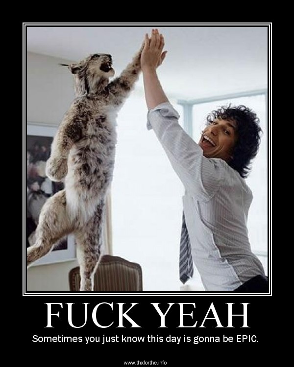

import { UiFigureWithCaption } from '../components/ui';

Looking for [Part 1 of 3: Childhood](/blog/2013-05-31-from-tables-to-tablets/)?

Maybe [Part 2 of 3: Adolescence](/blog/2013-06-02-from-tables-to-tablets-part-2-of-3-adolescence)?

## With great power comes... YOU KNOOOOW...

In early 2005 I joined a very young project, which later that year would see its first release on SourceForge.

The project was **jAPS - Java Agile Portal System**, an irriverent framework and portal system who wanted to subvert the canon in classic &mdash; solemn drums &mdash; Enterprise Portals à la _Liferay_, _Oracle Portal_, and friends.

We chose to walk the Web Standards and Web Accessibility way, meaning that I had to go even deeper in my knowledge of CSS.

I have fond memories of those months spent learning about faux column backgrounds, the countless image replacement techniques, the magic of a fluid and elastic layout as opposed to the classic pixel perfect approach.  
Often, I would get a pixel perfect web design from a designer I was working with and stealthly produce and ship the elastic variation instead.  
I learned to prefer margin on the contained element, over padding on the container one. I kept challenging myself at things like writing the most semantic HTML possible for a given page, and then styling it exactly as designed by the graphic designer adding as few _class_ attributes as I was able to.

So, meanwhile _jAPS_ (I know, I know! **No Japaneses involved!** More on this later) was lovingly raised up and empowered, I also kept on reading and learning and experimenting.

Because this is the way I roll.

From 2005 to 30 minutes ago, I just couldn't stop seeking new things to learn about my passion for the web, and for the Cascading Style Sheets.

When in 2007 _Blueprint CSS_ came out, I was as thrilled as nearly everyone and their uncle. I read some introductory articles, and the documentation, then decided I was ready to take it out for a spin.  
But I didn't do very well. I remember that feeling of being able to grasp its aim and final goal, versus an execution that to me was just unnatural, less than elegant &mdash; in a way.

Maybe I wasn't ready, maybe _Blueprint_ just didn't struck the right chords.

After _Blueprint_, I tried _960 Grid System_ and others, to not really better results.

On the other hand, my readings now where much improved in quality for I had discovered [**A List Apart**](http://alistapart.com/), [**Smashing Magazine**](http://www.smashingmagazine.com/), and [**24 Ways**](http://24ways.org/).  
_Oh my, A List Apart!_ Where would I be, without you? Long, in-depth, challenging articles written by the top professionals in our industry. I was (still am) just hooked by all that knowledge ready to be learned.

In 2009 I knew CSS3 was a thing. That year, for 24 Ways, Meagan Fisher wrote an amazing [article on designing mockups in markup](http://24ways.org/2009/make-your-mockup-in-markup/).

<UiFigureWithCaption caption='Epic day is gonna be epic.'>

</UiFigureWithCaption>

It was one of those _fuck yeah_ moments when you realize something you were thinking of for a while has just been streamlined and laid out in a nice, organized article by someone who is actually doing what you were thinking was possible doing.

Pieces of a jigsaw puzzle were coming together.

Because, you know, on 2010-05-25 A List Apart published this _strange_ article by Mr. Ethan Marcotte: [Responsive Web Design](http://alistapart.com/article/responsive-web-design).

Mind. Blown.

I had discovered another galaxy, I was accelerating. Thank the seven gods, once again there was an entire universe waiting to be explored.

By 2011, I had:

- explored CSS to the extremes
- started preferring in-browser mock-ups
- started experimenting with CSS3
- Responsive Web Design

One day, doing some research for my nightly experiments with CSS3, Google presented me with an amazing [3D text effect](http://markdotto.com/2011/01/05/3d-text-using-just-css/) by a guy with a quite unforgettable name and a catchy Twitter handle: Mark Otto aka @mdo.  
Insta-followed him, I moved on.

One more piece for the puzzle:

- Mark Otto

When Twitter Bootstrap descended on us, the puzzle was complete.  
I was there with my arms raised. It was all just so natural. The climax of a personal and technological evolution.  
A path reaching a milestone, a point fixed on a map.  
I started to follow its development, diving in the source code, using it for my experiments. It was just **so much better** than my first encounters with similar frameworks or grid systems!

Some lines above, I told you about jAPS.  
Well, as it happens, jAPS was a very clever acronym **and** a typical yankee insult against japanese people. We didn't know, we were young italians.  
So we started the transition to a better name: Entando.

[Entando](http://www.entando.com/) is now a powerful portal system and web development framework, and it has still the same goal: _Simplifying Enterprise Portals_.  
I am now R&D Director at Entando, and for version 3.2.0 I managed to get Bootstrap 2.3.1 in as the default front-end framework.  
Well, not much of a battle: the team and the founders, from Eugenio Santoboni, to Walter Ambu and Marco Diana, were as amazed as me by the possibilities Bootstrap was going to add to the frontend part of Entando.

But the best is yet to come: these days we are starting the work on Entando 4.0, which will sport a brand new backoffice. Add this to the fact that &mdash; as you may know &mdash; Bootstrap 3 is coming.

Given that I'm [closely following its development](https://github.com/twitter/bootstrap/pull/7799) since the start, the choice was simple.

Entando 4.0 will be great on its own, **and** its backoffice will be based on Bootstrap 3 (and maybe also its frontend will be updated).

You may think I could now rest some.

Not really, not me.

## To boldly go where no man has gone before

So this was the story of 15 years of work and passion.  
It started with tables, it's now at the tablets.

Who knows where will it be [tomorrow](http://www.google.com/glass/start/)?
